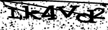

[](https://travis-ci.org/decryptr/captchaReceitaAudio)

**NÃO USAR. AINDA ESTÁ EM FASE INICIAL DE TESTES**

# captchaReceitaAudio

Captcha da Receita, mas usando o áudio no lugar de imagens.

Para instalar, rode

```r
if (!require(devtools)) install.packages('devtools')
devtools::install_github('decryptr/captchaReceitaAudio')
```

Para testar, rode

```r
library(magrittr)
library(captchaReceitaAudio)
# baixa arquivos .png e .wav na pasta atual
arq <- baixa_img_audio('./')

# desenha captcha
arq$imagem %>% visualizar_imagem()
```



## Predição

```r 
arq$audio %>% predizer()
#> [1] "lk4vd2"
```
